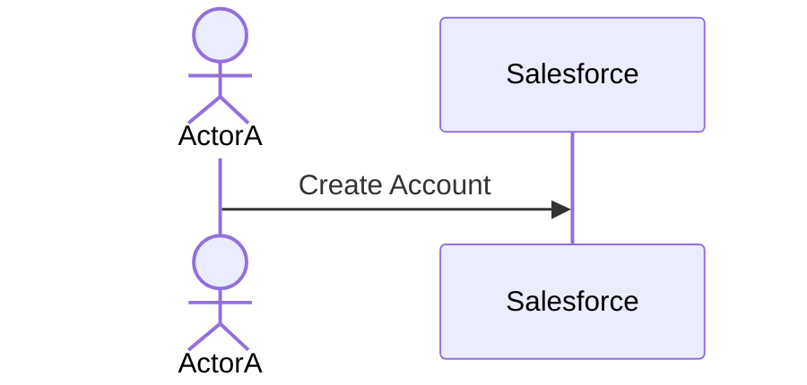
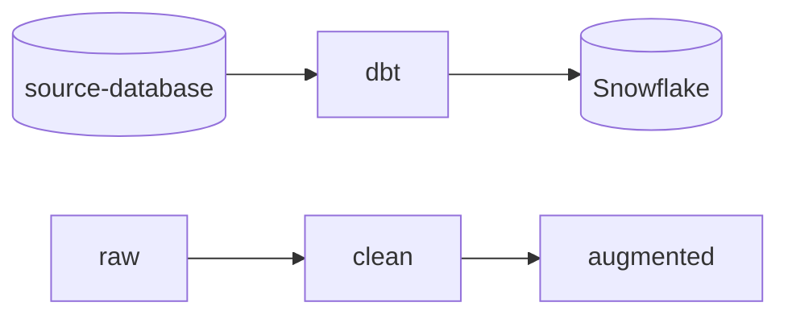
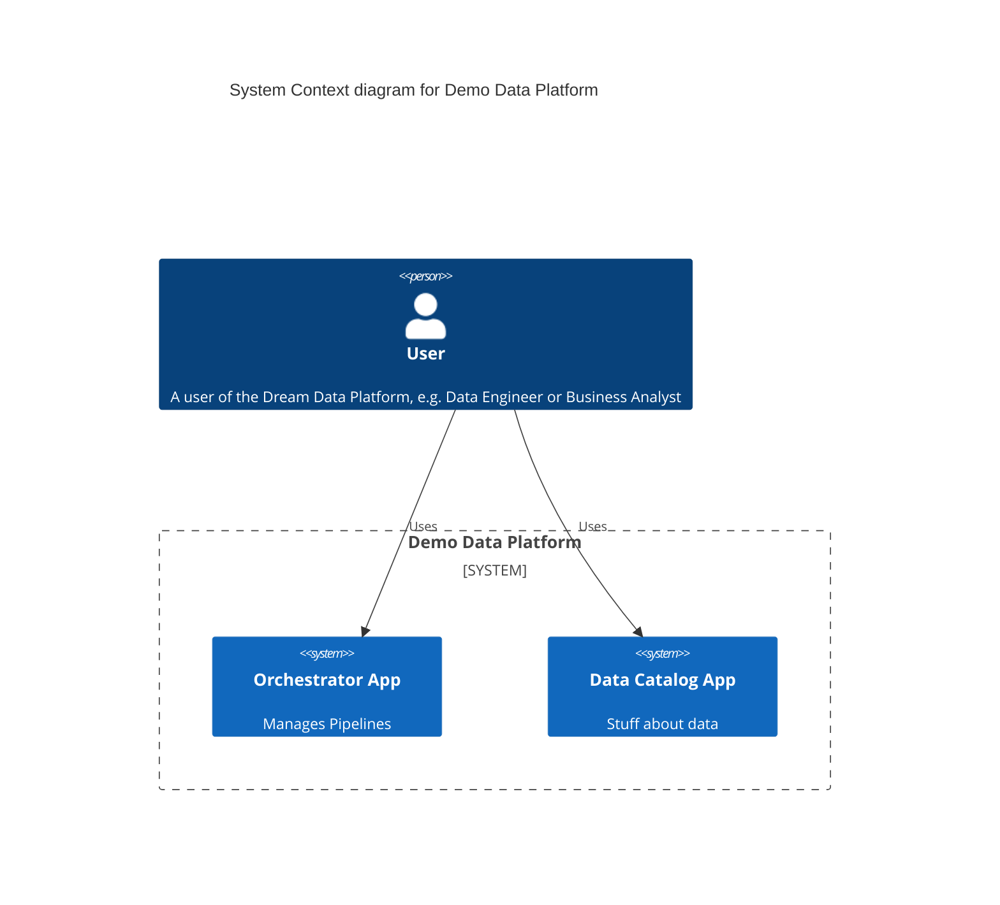
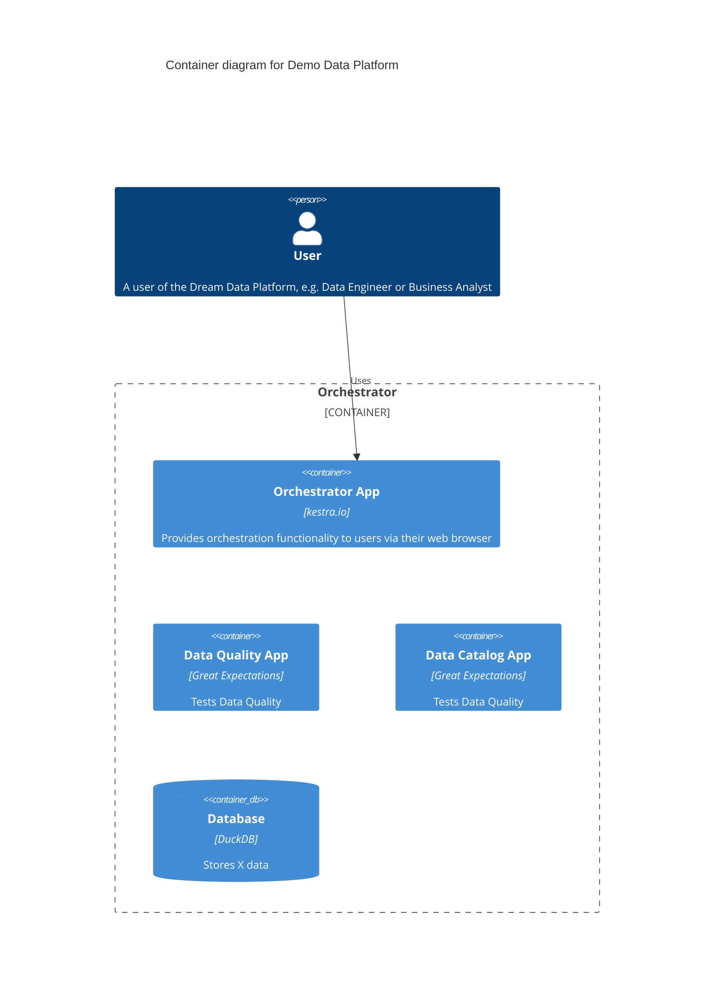
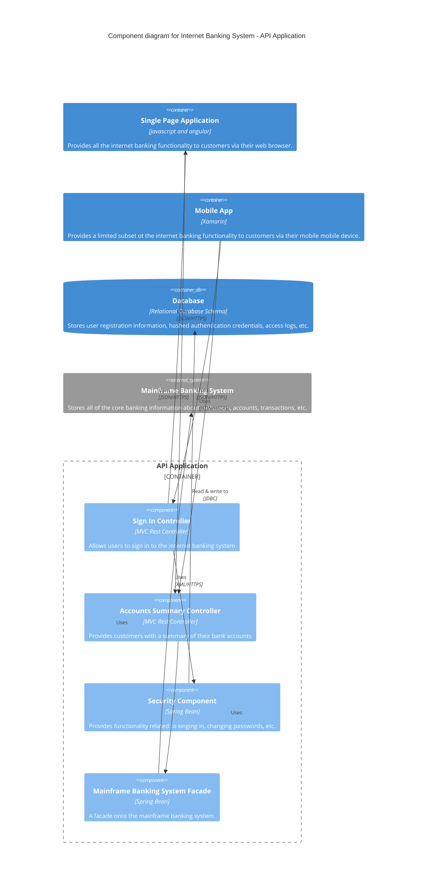

# PROPOSAL: {{cookiecutter.project_name}}

## Overview

The process is simple: first we define the problem, and based on that we propose one or more possible solutions.

## Problem Statement

What problem do we want to solve?

### Requirements

#### Functional Requirements

- FR001:
- FR002:

#### Technical Requirements

- TR001:
- TR002:

#### Out of Scope

- OOS001:
- OOS002:

### Business Process

## Proposed Solution

### Workflow

### Architecture

We use the [C4 model](https://c4model.com/) to define the architecture, and mermaid charts as the technology of choice to easily define this using markdown.

#### Level 1 - System Context Diagram

#### Level 2 - Container Diagram

#### Level 3 - Component Diagram

#### Level 4 - Dynamic Diagram

#### Level 5 - Deployment Diagram

### Deliverables

### Roadmap

